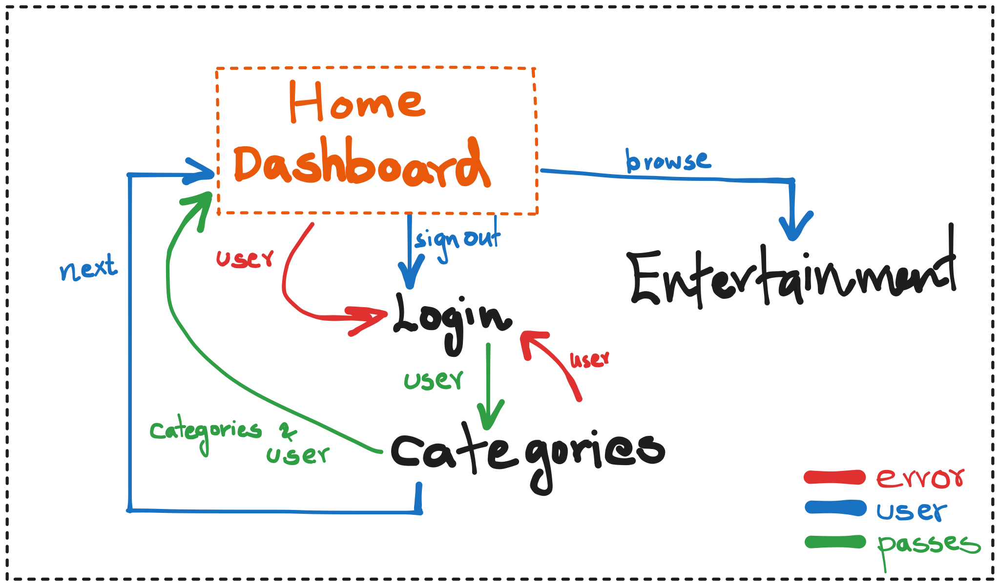

# Super App

create a `.env` file with following keys (openweathermap, NYT news, TMDB):
```env
VITE_OPENWEATHERMAP_KEY = 123
VITE_MOVIEDB_KEY = 123
VITE_NYTAPIKEY = 123
```


Running steps (using npm)
```
npm install
npm run dev
```

Running steps (using bun)
```
bun install
bun run dev
```

## Flow


### Issues possible (for contributions):
- [ ] saving notes into local storage as well
- [ ] providing entertainment based on picked categories
- [ ] mini dashboard page before main dashboard
- [ ] validation of data entered in login page (eg. username length)
- [ ] more weather icons
- [ ] timer restart button, timer flags, stop button
- [ ] timer digit scrolling animations
- [ ] link back to categories page from dashboard, 
    let user edit the categories at a later point
- [ ] Terms and conditions page, privacy policy page
